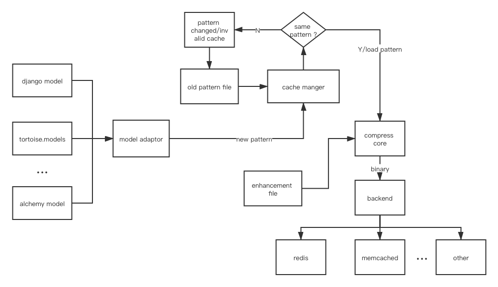

# model-compressor


## Problem

For relation database, we may build a big table and need to cache as much data as possible

We can directly stringfy  our model and stores to cache backend such as redis

```json
{ "firstName":"Bill" , "lastName":"Gates", "house": "111", "married": true, "has_child": false, "id": "063dc500-cbb4-4512-acdd-240596567e65"}
```

Or we can use the help of language built in serializer such as `pickle ` in python

```python3
pickle.dumps(a)
'(dp0\nVfirstName\np1\nVBill\np2\nsVhas_child\np3\nI00\nsVlastName\np4\nVGates\np5\nsVmarried\np6\nI01\nsVhouse\np7\nV111\np8\nsVid\np9\nV063dc500-cbb4-4512-acdd-240596567e65\np10\ns.'
```

But what if we a few hundres of different fields ? And we have millions of hot records access freneed to be cached ?

We need a few hundred GB of memory to store these hot data for each copy, Under the modern HA system, more than one copy will be stored in different server, and if we back up our data in different region, our bandwith may suffer

## Solution

What if we compress our data to binary format before storing to cache backend ?

Since our record is in stored in database, the column is fixed, and half of the column is of type `boolean`, `datetime`, and `uuid`

1. leave all the key fields, stores only the values
2. `boolean` can be represented as 0 and 1, and 8 `boolean` fields can be grouped together as 1 byte 
3. `datetime` can be represented as a timestamp, a 4 bytes integer instead of `2020-06-01 12:11:00`19 bytes characters
4. `uuid` can be represented as two 8 bytes long integer, instead of `"063dc500-cbb4-4512-acdd-240596567e65"` 36 bytes string
5. for string/unicode field
   * For non english text, scan all words in database, get the high frequency words to build a word-binary map, and design a binary-unicode mixed format to represent these values(we can't lose any data)
     * we can try deflate/LZW or other popular compress algorithm, but they may not work well in this single record-field situation
   * For english text, huffman tree will be enough

For a real record,  I come out with the result of  25 times smaller than origin stringfy record after doing manual compression


## RoadMap

* [ ] framework to support multiply ORM models and multiply cache backend in python

* [ ] design pattern file, it can be generated from ORM models automatically or written manually
* [ ] core compress model according to pattern file and source data, written in C/C++ to gain performance




## Usage

To be continued...